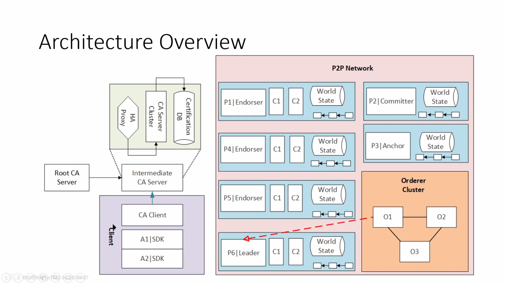

- [参考文档-getting start](https://hyperledger-fabric.readthedocs.io/en/release-2.2/getting_started.html#)

# 准备工作
- 需要安装git，curl，docker，docker compose
```sh
sudo apt install docker-compose
```
- 给当前用户运行docker的权限
```sh
# 创建docker组
sudo groupadd docker
# 将当前用户加入docker组
sudo usermod -aG docker tt
# 重启服务
sudo service docker restart
# 刷新docker成员
newgrp docker 
```

## go环境的安装
```sh
wget https://golang.google.cn/dl/go1.19.linux-amd64.tar.gz
tar -zxvf go1.19.linux-amd64.tar.gz
sudo mv go /usr/local/
sudo tee -a ~/.bachrc <<-'EOF'
export GOROOT=/usr/local/go
# export GOPATH=/home/go/goProject
export GOPROXY=https://goproxy.cn
export PATH=$PATH:$GOROOT/bin
EOF
source /etc/profile
```

# fabric的安装
- fabric提供了一个脚本，用于安装二进制文件和镜像
```sh
# 安装最新版本
curl -sSL https://bit.ly/2ysbOFE | bash -s
# 安装指定版本
curl -sSL https://bit.ly/2ysbOFE | bash -s -- <fabric_version> <fabric-ca_version>
curl -sSL https://bit.ly/2ysbOFE | bash -s -- 2.2.8 1.5.3
```

## 问题1--docker权限
- 我的环境中docker pull必须使用sudo，而curl并不推荐使用sudo
- 解决方案：先下载script，并修改，将第14行CONTAINER_CLI修改为`sudo docker`
```sh
curl -sSL https://bit.ly/2ysbOFE -o script.sh
chmod +x script.sh
vim script.sh
```

```sh
: ${CONTAINER_CLI:="docker"} # 改为sudo docker
```
- 解决方案2：重新安装docker，发现脚本结束后，有免root运行的脚本

## 问题2--pull缓慢
- 更换镜像
```sh
sudo mkdir -p /etc/docker
sudo tee /etc/docker/daemon.json <<-'EOF'
{
    "registry-mirrors" : [
    "https://registry.docker-cn.com",
    "http://hub-mirror.c.163.com",
    "https://docker.mirrors.ustc.edu.cn",
    "https://cr.console.aliyun.com",
    "https://mirror.ccs.tencentyun.com"
  ]
}
EOF
sudo systemctl daemon-reload
sudo systemctl restart docker
sudo docker info
```

# 部署一个测试网络
- [参考文档-Using the Fabric test network](https://hyperledger-fabric.readthedocs.io/en/release-2.2/test_network.html)
- test-network在`fabric-samples/test-network`下
## 查看帮助文本
```sh
./network.sh -h
```

```sh
Using docker and docker-compose
Usage: 
  network.sh <Mode> [Flags]
    Modes:
      up - Bring up Fabric orderer and peer nodes. No channel is created
      up createChannel - Bring up fabric network with one channel
      createChannel - Create and join a channel after the network is created
      deployCC - Deploy a chaincode to a channel (defaults to asset-transfer-basic)
      down - Bring down the network

    Flags:
    Used with network.sh up, network.sh createChannel:
    -ca <use CAs> -  Use Certificate Authorities to generate network crypto material
    -c <channel name> - Name of channel to create (defaults to "mychannel")
    -s <dbtype> - Peer state database to deploy: goleveldb (default) or couchdb
    -r <max retry> - CLI times out after certain number of attempts (defaults to 5)
    -d <delay> - CLI delays for a certain number of seconds (defaults to 3)
    -verbose - Verbose mode

    Used with network.sh deployCC
    -c <channel name> - Name of channel to deploy chaincode to
    -ccn <name> - Chaincode name.
    -ccl <language> - Programming language of the chaincode to deploy: go, java, javascript, typescript
    -ccv <version>  - Chaincode version. 1.0 (default), v2, version3.x, etc
    -ccs <sequence>  - Chaincode definition sequence. Must be an integer, 1 (default), 2, 3, etc
    -ccp <path>  - File path to the chaincode.
    -ccep <policy>  - (Optional) Chaincode endorsement policy using signature policy syntax. The default policy requires an endorsement from Org1 and Org2
    -cccg <collection-config>  - (Optional) File path to private data collections configuration file
    -cci <fcn name>  - (Optional) Name of chaincode initialization function. When a function is provided, the execution of init will be requested and the function will be invoked.

    -h - Print this message

 Possible Mode and flag combinations
   up -ca -r -d -s -verbose
   up createChannel -ca -c -r -d -s -verbose
   createChannel -c -r -d -verbose
   deployCC -ccn -ccl -ccv -ccs -ccp -cci -r -d -verbose

 Examples:
   network.sh up createChannel -ca -c mychannel -s couchdb
   network.sh createChannel -c channelName
   network.sh deployCC -ccn basic -ccp ../asset-transfer-basic/chaincode-javascript/ -ccl javascript
   network.sh deployCC -ccn mychaincode -ccp ./user/mychaincode -ccv 1 -ccl javascript
```

## 启动测试网络
```sh
./network.sh up
```
## 创建Channel
- channel是特定网络成员之间私有通信层，channel只能由邀请加入该channel的组织使用，并且对网络中的其他成员是不可见的。
- 每个channel都有一个独立的区块链账本。被邀请“加入”其同行的组织到channel来存储channel账本并验证channel上的交易。
```sh
./network.sh createChannel -c channel1
```

## 运行智能合约
- 在fabric中，智能合约是chainCode
- Chaincode安装在组织的对等端，然后部署到一个通道，然后可以使用它来批准交易，并与区块链账本交互。

```sh
./network.sh deployCC -ccn basic -ccp ../asset-transfer-basic/chaincode-go -ccl go
```
> 这里使用了go语言的环境
- `-ccl`指定了安装链码的语言，go/typescript/javascript
- `-ccp`指定了chainCode


## 销毁网络
```sh
./network.sh down
```

## 总结
- 测试时还有一部分是与网络交互，使用peer命令修改资产所有者等命令，测试网络有些内容还是不太清楚，运行暂时没有出错

# Fabric概要
- [参考视频](https://www.bilibili.com/video/BV1cz4y1C7dt?spm_id_from=333.999.0.0&vd_source=9338dca49c77890027835ec5abf98251)
- [参考博客](http://1uvu.com/2020/12/07/fabric-overview/)
- [参考笔记](https://github.com/1uvu/Blockchain-Notes)

可以参考笔记中的一个[思维导图](Blockchain-Notes/fabric-notes/2020.12.07%20Fabric%20Overview/2020.12.07%20Fabric%20Overview.xmind)进行学习
- Overview
- Server/Backend/API
  - Network
  - Chain Code
  - Ca
  - Ledger
  - Development process
- Client/Frontend/App
  - SDK
  - Development process
- Samples
  
## Server
### Network
是一个p2p网络，由两部分组成
- Peer Container，对等节点
  - Endorser，背书节点，根据背书策略对交易进行验证
  - Committer，提交节点，chainCode不会部署在Endorser之上，而是Committer上
> 集群管理 Kubernates
- Orderer Container，排序节点
### Ca
客户端服务端配合实现动态授予证书，支持实时添加对等节点数量
### Ledger
- BlockChain：TX记录，存储交易
  - channel，同一通道具有（可见）同一个公共账本
  - Hash pointer，支持哈希指针
  - Hashed linkList，支持哈希链表
- State DB：World/Current State，状态数据库
  - A peer，A DB
  - 存储交易的Index
  - Single/No-SQL -- key value存储，HTTP Api，通过http请求获得数据，段康康5984
  - level DB，默认引擎，k-v存储
  - Couch DB，数据库引擎，k-v存储，json存储
    - 顺序读写能力强，随机读取能力若

### Chain Code
- System Chain Code
  - 包括CSCC等，可以自定义
  - 创建时随peer一起启动，用于peer节点（而不是channel）上，只支持go
- User Chain Code
  - 用于操纵资产，提供操纵资产的接口
  - 具有生命周期，初始化-部署-实例化-调用
  - 运行于peer上的容器中
- 支持语言
  - **Golang**语言层面支持并发，适合服务端应用开发
  - Node
  - Java
## Client/Frontend/App
- 操作区块链网络，部署、执行 Chain code 提供的接口函数，监听网络事件，接收区块信息，写入交易等等
### SDK
- **Node**(推荐使用)
- TypeScript
- Golang
- Python
- Java

# Architecture


# 知识补充--Node.js
- 简单的说 Node.js 就是运行在服务端的 JavaScript。

## 创建Node.js应用
```js
var http = require('http');

http.createServer(function (request, response) {

    // 发送 HTTP 头部 
    // HTTP 状态值: 200 : OK
    // 内容类型: text/plain
    response.writeHead(200, {'Content-Type': 'text/plain'});

    // 发送响应数据 "Hello World"
    response.end('Hello World\n');
}).listen(8888);

// 终端打印如下信息
console.log('Server running at http://127.0.0.1:8888/');
```
- require函数载入http模块
- createServer创建服务器
- listen指定监听端口
- 使用node命令运行，访问8888端口

### 使用node命令运行
```sh
node server.js
```

## npm命令

- npm安装模块
```sh
npm install xxxx
```
安装好之后，express 包就放在了工程目录下的 node_modules 目录中，因此在代码中只需要通过 require('express') 的方式就好，无需指定第三方包路径。
- `-g`参数指定全局安装，即将安装包放在 /usr/local 下或者你 node 的安装目录。

## pacjage.json
  - 用于定义包的属性
  - name - 包名。
  - version - 包的版本号。
  - description - 包的描述。
  - homepage - 包的官网 url 。
  - author - 包的作者姓名。
  - contributors - 包的其他贡献者姓名。
  - dependencies - 依赖包列表。如果依赖包没有安装，npm 会自动将依赖包安装在 node_module 目录下。
  - repository - 包代码存放的地方的类型，可以是 git 或 svn，git 可在 Github 上。
  - main - main 字段指定了程序的主入口文件，require('moduleName') 就会加载这个文件。这个字段的默认值是模块根目录下面的 index.js。
  - keywords - 关键字
- 还可以使用`npm init` `npm adduser` `npm publish`发布自己的模块，使用`npm unpublish`取消发布模块

## REPL
- Read Eval Print Loop，交互式解释器，类似python的IDLE，可以输入代码并获得执行结果
- 通过`node`命令进入，快捷键`ctrl c`退出。
# Hellow World
- 参考教程[编写你的第一个应用](https://hyperledger-fabric.readthedocs.io/zh_CN/release-2.2/write_first_app.html)
## 具体内容
- 启动网络
- 使用Node登记管理员用户，注册和登记应用程序用户，查询账本，更新账本
- 清除数据
## startFabric.sh
```sh
pushd ../test-network
./network.sh down
./network.sh up createChannel -ca -s couchdb
./network.sh deployCC -ccn fabcar -ccv 1 -cci initLedger -ccl ${CC_SRC_LANGUAGE} -ccp ${CC_SRC_PATH}
popd
```
> 事实上就是启动test-network，创建两个peer节点和channel，再部署链码

# chaincode api
- [sdk](https://hyperledger-fabric.readthedocs.io/en/release-2.2/getting_started.html#hyperledger-fabric-application-sdks)有go，java和未正式发布的python

## 开发一个ChainCode（go）

### 创建struct
```go
package main

import (
    "fmt"

    "github.com/hyperledger/fabric-chaincode-go/shim"
    "github.com/hyperledger/fabric-protos-go/peer"
)

// SimpleAsset implements a simple chaincode to manage an asset
type SimpleAsset struct {
}
```

### 实现init方法
```go
// Init is called during chaincode instantiation to initialize any
// data. Note that chaincode upgrade also calls this function to reset
// or to migrate data, so be careful to avoid a scenario where you
// inadvertently clobber your ledger's data!
func (t *SimpleAsset) Init(stub shim.ChaincodeStubInterface) peer.Response {
  // Get the args from the transaction proposal
  args := stub.GetStringArgs()
  if len(args) != 2 {
    return shim.Error("Incorrect arguments. Expecting a key and a value")
  }

  // Set up any variables or assets here by calling stub.PutState()

  // We store the key and the value on the ledger
  err := stub.PutState(args[0], []byte(args[1]))
  if err != nil {
    return shim.Error(fmt.Sprintf("Failed to create asset: %s", args[0]))
  }
  return shim.Success(nil)
}
```
- 验证
> init方法可以是空

### 实现invoke函数
```go
// Invoke is called per transaction on the chaincode. Each transaction is
// either a 'get' or a 'set' on the asset created by Init function. The Set
// method may create a new asset by specifying a new key-value pair.
func (t *SimpleAsset) Invoke(stub shim.ChaincodeStubInterface) peer.Response {
    // Extract the function and args from the transaction proposal
    fn, args := stub.GetFunctionAndParameters()

    var result string
    var err error
    if fn == "set" {
            result, err = set(stub, args)
    } else {
            result, err = get(stub, args)
    }
    if err != nil {
            return shim.Error(err.Error())
    }

    // Return the result as success payload
    return shim.Success([]byte(result))
}
```

- 根据stub中的参数，调用get或set方法，并返回结果

### 实现get和set

```go
// Set stores the asset (both key and value) on the ledger. If the key exists,
// it will override the value with the new one
func set(stub shim.ChaincodeStubInterface, args []string) (string, error) {
    if len(args) != 2 {
            return "", fmt.Errorf("Incorrect arguments. Expecting a key and a value")
    }

    err := stub.PutState(args[0], []byte(args[1]))
    if err != nil {
            return "", fmt.Errorf("Failed to set asset: %s", args[0])
    }
    return args[1], nil
}

// Get returns the value of the specified asset key
func get(stub shim.ChaincodeStubInterface, args []string) (string, error) {
    if len(args) != 1 {
            return "", fmt.Errorf("Incorrect arguments. Expecting a key")
    }

    value, err := stub.GetState(args[0])
    if err != nil {
            return "", fmt.Errorf("Failed to get asset: %s with error: %s", args[0], err)
    }
    if value == nil {
            return "", fmt.Errorf("Asset not found: %s", args[0])
    }
    return string(value), nil
}
```

- 从ledger账本中读写数据

### 实现main方法
```go
func main() {
    if err := shim.Start(new(SimpleAsset)); err != nil {
            fmt.Printf("Error starting SimpleAsset chaincode: %s", err)
    }
}
```
> 在以上步骤的基础上，结合[shim api](https://pkg.go.dev/github.com/hyperledger/fabric-chaincode-go/shim#Chaincode)应该可以开发出其他功能