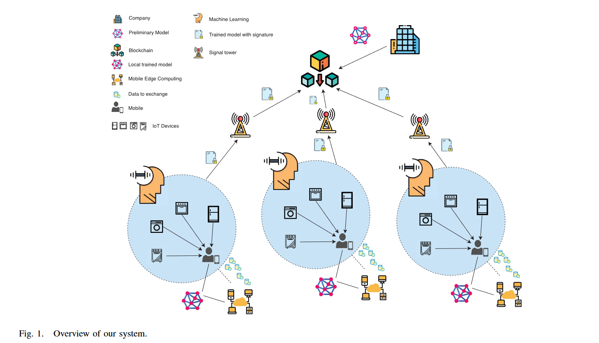

- [手动搭建hyperledger fabric v2.x](https://www.bilibili.com/video/BV1EK411F7zM?share_source=copy_web&vd_source=c0998bdf37e0d8b17312f4b808c58394)，其中第二个视频中，创建组织的锚节点文件已经被弃用
- [命令参考](https://hyperledger-fabric.readthedocs.io/zh_CN/release-2.2/command_ref.html)

> 计划配置一个4个节点的网络，三个节点模拟IOT设备，一个代表公司节点


# 主要工作
1. 创建了一个拥有两个org的通道
2. 自定义了一个网络，org1拥有三个节点，org2拥有1个节点
3. 用go语言自定义了chaincode并编译
4. 在网络上安装通道，执行链码

# fabric环境变量
- 为了使用cryptogen等工具
```sh
cd fabric-samples/bin
sudo echo export PATH=\$PATH:$(pwd) >> ~/.bashrc
source ~/.bashrc
```

# 创建节点目录，使用cryptogen命令
cryptogen 有如下五个子命令:
- help
- generate
- showtemplate
- extend
- version

## 创建模板文件
```sh
cryptogen showtemplate > crypto-config.yaml
```
## 修改模板
### 排序节点
```sh
# ---------------------------------------------------------------------------
# "OrdererOrgs" - Definition of organizations managing orderer nodes
# ---------------------------------------------------------------------------
OrdererOrgs:
  # ---------------------------------------------------------------------------
  # Orderer
  # ---------------------------------------------------------------------------
  - Name: Orderer
    Domain: fedfab.com
    EnableNodeOUs: false

    # ---------------------------------------------------------------------------
    # "Specs" - See PeerOrgs below for complete description
    # ---------------------------------------------------------------------------
    Specs:
      - Hostname: orderer
```
- EnableNodeOUs，即是否启用Organization Unit

### peer节点（组织1）
```sh
PeerOrgs:
  # ---------------------------------------------------------------------------
  # Org1
  # ---------------------------------------------------------------------------
  - Name: Org1
    Domain: org1.fedfab.com
    EnableNodeOUs: false #这里改为true
  Template:
    Count: 1 # 这里改为3.
    # Start: 5
    # Hostname: {{.Prefix}}{{.Index}} # default
    # SANS:
  #   - "{{.Hostname}}.alt.{{.Domain}}"
  Users:
    Count: 1 #这里也改为3
```

- User指操纵终端的人，在终端操纵的人

### peer节点（组织2）
```sh
  #---------------------------------------------------------------------------
  # Org2: See "Org1" for full specification
  # ---------------------------------------------------------------------------
  - Name: Org2
    Domain: org2.fedfab.com
    EnableNodeOUs: false #改成true
    Template:
      Count: 1
    Users:
      Count: 1
```

## 生成证书文件
```sh
cryptogen generate --config=crypto-config.yaml
```
- 输出，并创建了证书文件
```sh
org1.fedfab.com
org2.fedfab.com
```
- 进入一个组织查看
```sh
tt@tt-HP:~/Desktop/fabric/my-network/nodes/crypto-config/peerOrganizations/org1.fedfab.com$ ls
ca  msp  peers  tlsca  users
```

# 创建通道
- 编写configtx.yaml配置文件
- 使用configtxgen命令创建通道

## configtxgen的使用
- configtxgen 工具没有子命令，但是支持flag，通过设置flag可以完成不同的任务。
```sh
Usage of configtxgen:
  -asOrg string
      以特定组织（按名称）执行配置生成，仅包括组织（可能）有权设置的写集中的值。
  -channelCreateTxBaseProfile string
      指定要视为排序系统通道当前状态的轮廓（profile），以允许在通道创建交易生成期间修改非应用程序参数。仅在与 “outputCreateChannelTX”  结合时有效。
  -channelID string
      配置交易中使用的通道 ID。
  -configPath string
      包含所用的配置的路径。（如果设置的话）
  -inspectBlock string
      打印指定路径的区块中包含的配置。
  -inspectChannelCreateTx string
      打印指定路径的交易中包含的配置。
  -outputAnchorPeersUpdate string
      创建一个更新锚节点的配置更新（仅在默认通道创建时有效，并仅用于第一次更新）。
  -outputBlock string
      写入创世区块的路径。（如果设置的话）
  -outputCreateChannelTx string
      写入通道创建交易的路径。（如果设置的话）
  -printOrg string
      以 JSON 方式打印组织的定义。（手动向通道中添加组织时很有用）
  -profile string
      configtx.yaml 中用于生成的轮廓。
  -version
      显示版本信息。
```

## configtx.yaml的编写
官方文档在[创建新通道](https://hyperledger-fabric.readthedocs.io/zh_CN/release-2.2/create_channel/create_channel.html#the-configtx-yaml-file)中详细介绍了configtx.yaml的写法

这里我直接复制test-network中的配置文件并进行相应修改
## 创建configtx文件夹
```sh
mkdir configtx
```
## 修改配置文件
- 修改msp文件地址
将配置文件中的`MSPDir`-msp地址修改为在[生成证书文件](#生成证书文件)步骤中生成的文件的目录
- 修改证书地址
将配置文件中的`ClientTLSCert`和`ServerTLSCert`修改为在[生成证书文件](#生成证书文件)步骤中生成的文件的目录
- 写入创世块的配置文件
```yaml
TwoOrgsOrdererGenesis:
    <<: *ChannelDefaults
    Orderer:
        <<: *OrdererDefaults
        Organizations:
            - *OrdererOrg
        Capabilities:
            <<: *OrdererCapabilities
    Consortiums:
        SampleConsortium:
            Organizations:
                - *Org1
                - *Org2
```
> 编写yaml文件时要注意缩进，否则将导致执行失败

- 写入创建应用通道的配置
```yaml
TwoOrgsChannel:
    Consortium: SampleConsortium
    <<: *ChannelDefaults
    Application:
        <<: *ApplicationDefaults
        Organizations:
            - *Org1
            - *Org2
        Capabilities:
            <<: ***ApplicationCapabilities**
```
## 创建环境变量
```sh
export FABRIC_CFG_PATH=${PWD}/configtx
```
## 创建创世块
```sh
configtxgen -profile TwoOrgsOrdererGenesis -channelID system-channel -outputBlock ./system-genesis-block/genesis.block
```
得到输出
```sh
2022-08-27 20:52:53.432 CST 0001 INFO [common.tools.configtxgen] main -> Loading configuration
2022-08-27 20:52:53.441 CST 0002 INFO [common.tools.configtxgen.localconfig] completeInitialization -> orderer type: etcdraft
2022-08-27 20:52:53.441 CST 0003 INFO [common.tools.configtxgen.localconfig] completeInitialization -> Orderer.EtcdRaft.Options unset, setting to tick_interval:"500ms" election_tick:10 heartbeat_tick:1 max_inflight_blocks:5 snapshot_interval_size:16777216 
2022-08-27 20:52:53.441 CST 0004 INFO [common.tools.configtxgen.localconfig] Load -> Loaded configuration: /home/tt/Desktop/fabric/my-network/nodes/configtx/configtx.yaml
2022-08-27 20:52:53.443 CST 0005 INFO [common.tools.configtxgen] doOutputBlock -> Generating genesis block
2022-08-27 20:52:53.443 CST 0006 INFO [common.tools.configtxgen] doOutputBlock -> Creating system channel genesis block
2022-08-27 20:52:53.443 CST 0007 INFO [common.tools.configtxgen] doOutputBlock -> Writing genesis block
```

## 创建应用通道
```sh
configtxgen -profile TwoOrgsChannel -outputCreateChannelTx ./channel-artifacts/channel2.tx -channelID channel2
configtxgen -profile TwoOrgsChannel -outputAnchorPeersUpdate ./channel-artifacts/Org1MSPanchors.tx -channelID channel2 -asOrg Org1MSP
configtxgen -profile TwoOrgsChannel -outputAnchorPeersUpdate ./channel-artifacts/Org2MSPanchors.tx -channelID channel2 -asOrg Org2MSP
```

得到输出
```sh
2022-08-27 21:01:01.223 CST 0001 INFO [common.tools.configtxgen] main -> Loading configuration
2022-08-27 21:01:01.233 CST 0002 INFO [common.tools.configtxgen.localconfig] Load -> Loaded configuration: /home/tt/Desktop/fabric/my-network/nodes/configtx/configtx.yaml
2022-08-27 21:01:01.233 CST 0003 INFO [common.tools.configtxgen] doOutputChannelCreateTx -> Generating new channel configtx
2022-08-27 21:01:01.235 CST 0004 INFO [common.tools.configtxgen] doOutputChannelCreateTx -> Writing new channel tx
```

# 创建peer节点和order节点
- 使用docker compose对节点容器进行定义
- 在test-network的基础上进行修改
## 修改order节点
```yaml
  orderer.fedfab.com:
    container_name: orderer.fedfab.com
    image: hyperledger/fabric-orderer:latest
    labels:
      service: hyperledger-fabric
    environment:
      - FABRIC_LOGGING_SPEC=INFO
      - ORDERER_GENERAL_LISTENADDRESS=0.0.0.0
      - ORDERER_GENERAL_LISTENPORT=7050
      - ORDERER_GENERAL_LOCALMSPID=OrdererMSP
      - ORDERER_GENERAL_LOCALMSPDIR=/var/hyperledger/orderer/msp
      # enabled TLS
      - ORDERER_GENERAL_TLS_ENABLED=true
      - ORDERER_GENERAL_TLS_PRIVATEKEY=/var/hyperledger/orderer/tls/server.key
      - ORDERER_GENERAL_TLS_CERTIFICATE=/var/hyperledger/orderer/tls/server.crt
      - ORDERER_GENERAL_TLS_ROOTCAS=[/var/hyperledger/orderer/tls/ca.crt]
      - ORDERER_GENERAL_CLUSTER_CLIENTCERTIFICATE=/var/hyperledger/orderer/tls/server.crt
      - ORDERER_GENERAL_CLUSTER_CLIENTPRIVATEKEY=/var/hyperledger/orderer/tls/server.key
      - ORDERER_GENERAL_CLUSTER_ROOTCAS=[/var/hyperledger/orderer/tls/ca.crt]
      # - ORDERER_GENERAL_BOOTSTRAPMETHOD=none #去掉
      - ORDERER_GENERAL_GENESISMETHOD=file #增加
      - ORDERER_GENERAL_GENESISFILE=/var/hyperledger/orderer/system-genesis-block/genesis.block #增加
      - ORDERER_CHANNELPARTICIPATION_ENABLED=true
      - ORDERER_ADMIN_TLS_ENABLED=true
      - ORDERER_ADMIN_TLS_CERTIFICATE=/var/hyperledger/orderer/tls/server.crt
      - ORDERER_ADMIN_TLS_PRIVATEKEY=/var/hyperledger/orderer/tls/server.key
      - ORDERER_ADMIN_TLS_ROOTCAS=[/var/hyperledger/orderer/tls/ca.crt]
      - ORDERER_ADMIN_TLS_CLIENTROOTCAS=[/var/hyperledger/orderer/tls/ca.crt]
      - ORDERER_ADMIN_LISTENADDRESS=0.0.0.0:7053
      - ORDERER_OPERATIONS_LISTENADDRESS=orderer.fedfab.com:9443
      - ORDERER_METRICS_PROVIDER=prometheus
    working_dir: /root
    command: orderer
    volumes:
        - ../crypto-config/ordererOrganizations/fedfab.com/orderers/orderer.fedfab.com/msp:/var/hyperledger/orderer/msp
        - ../crypto-config/ordererOrganizations/fedfab.com/orderers/orderer.fedfab.com/tls/:/var/hyperledger/orderer/tls
        - ../system-genesis-block/:/var/hyperledger/orderer/system-genesis-block #增加
        - orderer.fedfab.com:/var/hyperledger/production/orderer
    ports:
      - 7050:7050
      - 7053:7053
      - 9443:9443
    networks:
      - test
```
- 后续会手动生成创世块，需要在compose中指定生成的创世块


## 增加节点个数
- test-network中只有三个节点（排序和两个peer节点），现在修改为1排序+3org1+1org2

```yaml
volumes:
  orderer.fedfab.com:
  peer0.org1.fedfab.com:
  peer1.org1.fedfab.com:
  peer2.org1.fedfab.com:
  peer0.org2.fedfab.com:
```
- 增加org1中的节点配置，以下面的配置文件为模板
```yaml
  peer0.org1.fedfab.com: #修改
    container_name: peer0.org1.fedfab.com #修改
    image: hyperledger/fabric-peer:latest
    labels:
      service: hyperledger-fabric
    environment:
      - FABRIC_CFG_PATH=/etc/hyperledger/peercfg
      - FABRIC_LOGGING_SPEC=INFO
      #- FABRIC_LOGGING_SPEC=DEBUG
      - CORE_PEER_TLS_ENABLED=true
      - CORE_PEER_PROFILE_ENABLED=false
      - CORE_PEER_TLS_CERT_FILE=/etc/hyperledger/fabric/tls/server.crt
      - CORE_PEER_TLS_KEY_FILE=/etc/hyperledger/fabric/tls/server.key
      - CORE_PEER_TLS_ROOTCERT_FILE=/etc/hyperledger/fabric/tls/ca.crt
      # Peer specific variables
      - CORE_PEER_ID=peer0.org1.fedfab.com #修改
      - CORE_PEER_ADDRESS=peer0.org1.fedfab.com:7051 #修改
      - CORE_PEER_LISTENADDRESS=0.0.0.0:7051
      - CORE_PEER_CHAINCODEADDRESS=peer0.org1.fedfab.com:7052 #修改
      - CORE_PEER_CHAINCODELISTENADDRESS=0.0.0.0:7052
      - CORE_PEER_GOSSIP_BOOTSTRAP=peer0.org1.fedfab.com:7051 #修改
      - CORE_PEER_GOSSIP_EXTERNALENDPOINT=peer0.org1.fedfab.com:7051
      - CORE_PEER_LOCALMSPID=Org1MSP
      - CORE_PEER_MSPCONFIGPATH=/etc/hyperledger/fabric/msp
      - CORE_OPERATIONS_LISTENADDRESS=peer0.org1.fedfab.com:9444 #修改
      - CORE_METRICS_PROVIDER=prometheus
      - CHAINCODE_AS_A_SERVICE_BUILDER_CONFIG={"peername":"peer0org1"} #修改
      - CORE_CHAINCODE_EXECUTETIMEOUT=300s
    volumes:
        - ../organizations/peerOrganizations/org1.fedfab.com/peers/peer0.org1.fedfab.com:/etc/hyperledger/fabric #修改
        - peer0.org1.fedfab.com:/var/hyperledger/production #修改
    working_dir: /root
    command: peer node start
    ports:
      - 7051:7051 #修改
      - 9444:9444 #修改
    networks:
      - test
```
## 修改容器的文件夹映射
- 将tls，mse等路径，域名名称修改正确

## 修改端口号
|编号|端口配置|
|-|-|
|orderer.fedfab.com|7050:7050, 7053:7053, 9443:9443|
|peer0.org1.fedfab.com|8051:7051, 9444:9444|
|peer1.org1.fedfab.com|8052:7051, 9445:9444|
|peer2.org1.fedfab.com|8053:7051, 9446:9444|
|peer0.org2.fedfab.com|9051:7051, 9447:9444|

## CLI（命令行接口）配置
- 为每个节点创建一个cli
- 参考官方的cli配置教程，cli需要以下环境变量
```sh
export FABRIC_CFG_PATH=$PWD/../config/
export CORE_PEER_TLS_ENABLED=true
export CORE_PEER_LOCALMSPID="Org1MSP"
export CORE_PEER_TLS_ROOTCERT_FILE=${PWD}/organizations/peerOrganizations/org1.fedfab.com/peers/peer0.org1.fedfab.com/tls/ca.crt
export CORE_PEER_MSPCONFIGPATH=${PWD}/organizations/peerOrganizations/org1.fedfab.com/users/Admin@org1.fedfab.com/msp
export CORE_PEER_ADDRESS=localhost:7051
```
- 根据上述环境变量和test-network中的cli配置，编写四个节点的cli
```yaml
  cli1: #修改
    container_name: cli1 #修改
    image: hyperledger/fabric-tools:latest
    labels:
      service: hyperledger-fabric
    tty: true
    stdin_open: true
    environment:
      - GOPATH=/opt/gopath
      - FABRIC_LOGGING_SPEC=INFO
      - FABRIC_CFG_PATH=/etc/hyperledger/peercfg
      #- FABRIC_LOGGING_SPEC=DEBUG
      - CORE_PEER_ID=cli1 #修改
      - CORE_PEER_TLS_ENABLED=true
      - CORE_PEER_LOCALMSPID=Org1MSP  #修改
      - CORE_PEER_TLS_KEY_FILE=/opt/gopath/src/github.com/hyperledger/fabric/peer/crypto/peerOrganizations/org1.fedfab.com/peers/peer0.org1.fedfab.com/tls/server.crt  #修改
      - CORE_PEER_TLS_CERT_FILE=/opt/gopath/src/github.com/hyperledger/fabric/peer/crypto/peerOrganizations/org1.fedfab.com/peers/peer0.org1.fedfab.com/tls/server.key  #修改
      - CORE_PEER_TLS_ROOTCERT_FILE=/opt/gopath/src/github.com/hyperledger/fabric/peer/crypto/peerOrganizations/org1.fedfab.com/peers/peer0.org1.fedfab.com/tls/ca.crt  #修改
      - CORE_PEER_MSPCONFIGPATH=/opt/gopath/src/github.com/hyperledger/fabric/peer/crypto/peerOrganizations/org1.fedfab.com/users/Admin@org1.fedfab.com/msp  #修改
      - CORE_PEER_ADDRESS=peer0.org1.fedfab.com:8051  #修改
    working_dir: /opt/gopath/src/github.com/hyperledger/fabric/peer
    command: /bin/bash
    volumes:
        - ../crypto-config:/opt/gopath/src/github.com/hyperledger/fabric/peer/crypto
        - ../scripts:/opt/gopath/src/github.com/hyperledger/fabric/peer/scripts/
        - /var/run/:/host/var/run/
        - ../chaincode/go/:/opt/gopath/src/github.com/hyperledger/fabric-cluster/chaincode/go
        - ../channel-artifacts:/opt/gopath/src/github.com/hyperledger/fabric/peer/channel-artifacts
        - ./docker/peercfg:/etc/hyperledger/peercfg
    depends_on:
      - peer0.org1.fedfab.com  #修改
    networks:
      - test
```

## 运行
```sh
docker-compose up -d
```
得到输出
```sh
Creating network "fabric_test" with the default driver
Creating volume "compose_orderer.fedfab.com" with default driver
Creating volume "compose_peer0.org1.fedfab.com" with default driver
Creating volume "compose_peer1.org1.fedfab.com" with default driver
Creating volume "compose_peer2.org1.fedfab.com" with default driver
Creating volume "compose_peer0.org2.fedfab.com" with default driver
Creating peer0.org1.fedfab.com ... done
Creating peer0.org2.fedfab.com ... done
Creating peer1.org1.fedfab.com ... done
Creating peer2.org1.fedfab.com ... done
Creating orderer.fedfab.com    ... done
Creating cli0                   ... done
Creating cli3                   ... done
Creating cli1                   ... done
Creating cli2                   ... done
```

## 验证容器是否启动
```sh
docker ps -a
```

```sh
CONTAINER ID   IMAGE                               COMMAND             CREATED         STATUS                     PORTS                                                                                                                             NAMES
d6a76f883fff   hyperledger/fabric-tools:latest     "/bin/bash"         3 seconds ago   Up 2 seconds                                                                                                                                                 cli3
77b3a4f45dd7   hyperledger/fabric-tools:latest     "/bin/bash"         3 seconds ago   Up 2 seconds                                                                                                                                                 cli1
cc967bbbffbc   hyperledger/fabric-tools:latest     "/bin/bash"         3 seconds ago   Up 2 seconds                                                                                                                                                 cli2
4cac839a509e   hyperledger/fabric-tools:latest     "/bin/bash"         4 seconds ago   Up 2 seconds                                                                                                                                                 cli0
dd8fb44841ed   hyperledger/fabric-peer:latest      "peer node start"   4 seconds ago   Exited (1) 2 seconds ago                                                                                                                                     peer1.org1.fedfab.com
37d044dc815b   hyperledger/fabric-peer:latest      "peer node start"   4 seconds ago   Exited (1) 3 seconds ago                                                                                                                                     peer2.org1.fedfab.com
c5d9572fd1b0   hyperledger/fabric-peer:latest      "peer node start"   4 seconds ago   Exited (1) 2 seconds ago                                                                                                                                     peer0.org2.fedfab.com
fa43da3532d7   hyperledger/fabric-orderer:latest   "orderer"           4 seconds ago   Up 3 seconds               0.0.0.0:7050->7050/tcp, :::7050->7050/tcp, 0.0.0.0:7053->7053/tcp, :::7053->7053/tcp, 0.0.0.0:9443->9443/tcp, :::9443->9443/tcp   orderer.fedfab.com
45b71846f669   hyperledger/fabric-peer:latest      "peer node start"   4 seconds ago   Exited (1) 3 seconds ago                                                                                                                                     peer0.org1.fedfab.com
```

- 使用logs命令查看日志
```sh
docker logs peer0.org1.fedfab.com
2022-08-28 11:18:05.811 UTC 0001 ERRO [main] InitCmd -> Fatal error when initializing core config : FABRIC_CFG_PATH /etc/hyperledger/peercfg does not exist
```

- 根据[docker hub - fabric-peer](https://hub.docker.com/r/hyperledger/fabric-peer)的描述，在`FABRIC_CFG_PATH`下需要有core.yaml文件
- 复制一份test-network的core.yaml到compose文件夹下
- 在peer节点中添加映射
```yaml
- ./docker/peercfg:/etc/hyperledger/peercfg
```

- 再次尝试创建容器，并使用ps命令验证

```sh
CONTAINER ID   IMAGE                               COMMAND             CREATED         STATUS         PORTS                                                                                                                             NAMES
eaa7a6ad0dc4   hyperledger/fabric-tools:latest     "/bin/bash"         4 seconds ago   Up 3 seconds                                                                                                                                     cli3
6cfcf59846eb   hyperledger/fabric-tools:latest     "/bin/bash"         5 seconds ago   Up 3 seconds                                                                                                                                     cli2
29fe65400204   hyperledger/fabric-tools:latest     "/bin/bash"         5 seconds ago   Up 3 seconds                                                                                                                                     cli1
4ac9037d3c2c   hyperledger/fabric-tools:latest     "/bin/bash"         5 seconds ago   Up 4 seconds                                                                                                                                     cli0
a5e90a5b170a   hyperledger/fabric-peer:latest      "peer node start"   5 seconds ago   Up 4 seconds   7051/tcp, 0.0.0.0:9051->9051/tcp, :::9051->9051/tcp, 0.0.0.0:9447->9445/tcp, :::9447->9445/tcp                                    peer0.org2.fedfab.com
9b3b0f6445d2   hyperledger/fabric-peer:latest      "peer node start"   5 seconds ago   Up 4 seconds   0.0.0.0:9444->9444/tcp, :::9444->9444/tcp, 0.0.0.0:8051->7051/tcp, :::8051->7051/tcp                                              peer0.org1.fedfab.com
5d75a82337c8   hyperledger/fabric-peer:latest      "peer node start"   5 seconds ago   Up 4 seconds   0.0.0.0:8052->7051/tcp, :::8052->7051/tcp, 0.0.0.0:9445->9444/tcp, :::9445->9444/tcp                                              peer1.org1.fedfab.com
5eb7a92eb4e0   hyperledger/fabric-orderer:latest   "orderer"           5 seconds ago   Up 4 seconds   0.0.0.0:7050->7050/tcp, :::7050->7050/tcp, 0.0.0.0:7053->7053/tcp, :::7053->7053/tcp, 0.0.0.0:9443->9443/tcp, :::9443->9443/tcp   orderer.fedfab.com
17c6798b2dc9   hyperledger/fabric-peer:latest      "peer node start"   5 seconds ago   Up 4 seconds   0.0.0.0:8053->7051/tcp, :::8053->7051/tcp, 0.0.0.0:9446->9444/tcp, :::9446->9444/tcp                                              peer2.org1.fedfab.com
```

- 全部容器都已经启动成功！

# 补充
- 在test-network的network.sh脚本中仔细观察docker-compose的代码发现，test-network中使用了多个yml文件进行配置

```sh
function networkUp() {
  checkPrereqs

  # generate artifacts if they don't exist
  if [ ! -d "organizations/peerOrganizations" ]; then
    createOrgs
  fi

  COMPOSE_FILES="-f compose/${COMPOSE_FILE_BASE} -f compose/${CONTAINER_CLI}/${CONTAINER_CLI}-${COMPOSE_FILE_BASE}" #此处

  if [ "${DATABASE}" == "couchdb" ]; then
    COMPOSE_FILES="${COMPOSE_FILES} -f compose/${COMPOSE_FILE_COUCH} -f compose/${CONTAINER_CLI}/${CONTAINER_CLI}-${COMPOSE_FILE_COUCH}"
  fi

  DOCKER_SOCK="${DOCKER_SOCK}" ${CONTAINER_CLI_COMPOSE} ${COMPOSE_FILES} up -d 2>&1

  $CONTAINER_CLI ps -a
  if [ $? -ne 0 ]; then
    fatalln "Unable to start network"
  fi
}
```

故找到相应文件，将其中的配置添加到节点中（这也就是之前peer节点创建后启动失败的原因）
```yaml
version: '3.7'
services:
  peer0.org1.fedfab.com:
    container_name: peer0.org1.fedfab.com
    image: hyperledger/fabric-peer:latest
    labels:
      service: hyperledger-fabric
    environment:
      #Generic peer variables
      - CORE_VM_ENDPOINT=unix:///host/var/run/docker.sock
      - CORE_VM_DOCKER_HOSTCONFIG_NETWORKMODE=fabric_test
    volumes:
      - ./docker/peercfg:/etc/hyperledger/peercfg
      - ${DOCKER_SOCK}:/host/var/run/docker.sock

  peer0.org2.fedfab.com:
    container_name: peer0.org2.fedfab.com
    image: hyperledger/fabric-peer:latest
    labels:
      service: hyperledger-fabric
    environment:
      #Generic peer variables
      - CORE_VM_ENDPOINT=unix:///host/var/run/docker.sock
      - CORE_VM_DOCKER_HOSTCONFIG_NETWORKMODE=fabric_test
    volumes:
      - ./docker/peercfg:/etc/hyperledger/peercfg
      - ${DOCKER_SOCK}:/host/var/run/docker.sock
  
  cli:
    container_name: cli
    image: hyperledger/fabric-tools:latest
    volumes:
      - ./docker/peercfg:/etc/hyperledger/peercfg
```
- 使用docer-compose命令创建容器(添加DOCKER_SOCK)环境变量
```sh
SOCK="${DOCKER_HOST:-/var/run/docker.sock}"
export DOCKER_SOCK="${SOCK##unix://}"
docker-compose up -d
```

> docker容器建立了，但是docker-compose的配置文件中的很多细节并不清楚

# 修改host文件
```sh
sudo tee -a /etc/hosts <<-'EOF'
127.0.0.1 orderer.fedfab.com
127.0.0.1 peer0.org1.fedfab.com
127.0.0.1 peer1.org1.fedfab.com
127.0.0.1 peer2.org1.fedfab.com
127.0.0.1 peer0.org2.fedfab.com
EOF
cat /etc/hosts
```

# 安装链码
- [参考](https://github.com/hyperledger/fabric-contract-api-go/blob/main/tutorials/getting-started.md)
  
## Housekeeping
初始化mod，获取fabric模块
```sh
go mod init github.com/hyperledger/fabric-samples/chaincode/mycontract
go get -u github.com/hyperledger/fabric-contract-api-go
```

## 编写链码，编译
编写好chaincode.go，下载依赖包，编译
```sh
go mod vendor
go build
```

## 配置通道
- [peer命令介绍](https://hyperledger-fabric.readthedocs.io/zh_CN/latest/commands/peercommand.html)
### 进入cli容器
```sh
docker exec -it cli0 sh
docker exec -it cli1 sh
docker exec -it cli2 sh
docker exec -it cli3 sh
```
### 安装通道
```sh
peer channel create -o orderer.fedfab.com:7050 -c channel2 -f ./channel-artifacts/channel2.tx --tls true --cafile /opt/gopath/src/github.com/hyperledger/fabric/peer/crypto/ordererOrganizations/fedfab.com/msp/tlscacerts/tlsca.fedfab.com-cert.pem
```
```sh
2022-08-29 08:31:23.202 UTC 0001 INFO [channelCmd] InitCmdFactory -> Endorser and orderer connections initialized
2022-08-29 08:31:23.211 UTC 0002 INFO [cli.common] readBlock -> Expect block, but got status: &{NOT_FOUND}
2022-08-29 08:31:23.214 UTC 0003 INFO [channelCmd] InitCmdFactory -> Endorser and orderer connections initialized
2022-08-29 08:31:23.415 UTC 0004 INFO [cli.common] readBlock -> Expect block, but got status: &{SERVICE_UNAVAILABLE}
2022-08-29 08:31:23.417 UTC 0005 INFO [channelCmd] InitCmdFactory -> Endorser and orderer connections initialized
2022-08-29 08:31:23.619 UTC 0006 INFO [cli.common] readBlock -> Expect block, but got status: &{SERVICE_UNAVAILABLE}
2022-08-29 08:31:23.621 UTC 0007 INFO [channelCmd] InitCmdFactory -> Endorser and orderer connections initialized
2022-08-29 08:31:23.822 UTC 0008 INFO [cli.common] readBlock -> Expect block, but got status: &{SERVICE_UNAVAILABLE}
2022-08-29 08:31:23.824 UTC 0009 INFO [channelCmd] InitCmdFactory -> Endorser and orderer connections initialized
2022-08-29 08:31:24.026 UTC 000a INFO [cli.common] readBlock -> Expect block, but got status: &{SERVICE_UNAVAILABLE}
2022-08-29 08:31:24.028 UTC 000b INFO [channelCmd] InitCmdFactory -> Endorser and orderer connections initialized
2022-08-29 08:31:24.229 UTC 000c INFO [cli.common] readBlock -> Expect block, but got status: &{SERVICE_UNAVAILABLE}
2022-08-29 08:31:24.231 UTC 000d INFO [channelCmd] InitCmdFactory -> Endorser and orderer connections initialized
2022-08-29 08:31:24.434 UTC 000e INFO [cli.common] readBlock -> Received block: 0
```

### 将生成的channel2.block复制到其他cli中
```sh
docker cp cli0:/opt/gopath/src/github.com/hyperledger/fabric/peer/channel2.block ./
docker cp ./channel2.block cli1:/opt/gopath/src/github.com/hyperledger/fabric/peer/channel2.block
docker cp ./channel2.block cli2:/opt/gopath/src/github.com/hyperledger/fabric/peer/channel2.block
docker cp ./channel2.block cli3:/opt/gopath/src/github.com/hyperledger/fabric/peer/channel2.block
```

### 加入channel
分别进入四个cli，执行以下命令
```sh
peer channel join -b ./channel2.block
```

```sh
2022-08-29 08:55:24.659 UTC 0001 INFO [channelCmd] InitCmdFactory -> Endorser and orderer connections initialized
2022-08-29 08:55:24.695 UTC 0002 INFO [channelCmd] executeJoin -> Successfully submitted proposal to join channel
```

- 第一次执行时，cli0-cli2出现了connection refuse的情况，对docker compose文件进行修改，重新进行端口映射，则正常。这里出现这个问题的原因不详，容器内的端口号必须和外面匹配才行

|编号|端口配置|
|-|-|
|orderer.fedfab.com|7050:7050, 7053:7053, 9443:9443|
|peer0.org1.fedfab.com|8051:8051, 9444:9444|
|peer1.org1.fedfab.com|8053:8053, 9445:9444|
|peer2.org1.fedfab.com|8055:8055, 9446:9444|
|peer0.org2.fedfab.com|9051:7051, 9447:9444|

- 验证是否加入通道
```sh
peer channel getinfo -c channel2
```
```sh
2022-08-29 09:28:21.265 UTC 0001 INFO [channelCmd] InitCmdFactory -> Endorser and orderer connections initialized
Blockchain info: {"height":1,"currentBlockHash":"xHaVldOzr0XQgw20tyMdri5No9dZuSQMez7jUOew/TU="}
```
### 配置锚节点
- 获取通道配置
```sh
peer channel fetch config channel-artifacts/config_block.pb -o orderer.fedfab.com:7050 -c channel2 --tls --cafile ${PWD}/crypto/ordererOrganizations/fedfab.com/orderers/orderer.fedfab.com/msp/tlscacerts/tlsca.fedfab.com-cert.pem
cd channel-artifacts
```
- pb文件转为json文件
```sh
configtxlator proto_decode --input config_block.pb --type common.Block --output config_block.json
jq .data.data[0].payload.data.config config_block.json > config.json
cp config.json config_copy.json
```
- 使用jq工具将Org1的Peer锚节点添加到通道配置中

```sh
jq '.channel_group.groups.Application.groups.Org2MSP.values += {"AnchorPeers":{"mod_policy": "Admins","value":{"anchor_peers": [{"host": "peer0.org2.fedfab.com","port": 9051}]},"version": "0"}}' config_copy.json > modified_config.json
```
- 完成此步骤后，我们在modified_config.json文件中以JSON格式获取了通道配置的更新版本。现在，我们可以将原始和修改的通道配置都转换回protobuf格式，并计算它们之间的差异。
```sh
configtxlator proto_encode --input config.json --type common.Config --output config.pb
configtxlator proto_encode --input modified_config.json --type common.Config --output modified_config.pb
configtxlator compute_update --channel_id channel2 --original config.pb --updated modified_config.pb --output config_update.pb
```
- 名为channel_update.pb的新的protobuf包含我们需要应用于通道配置的Peer锚节点更新。我们可以将配置更新包装在交易Envelope中，以创建通道配置更新交易。
```sh
configtxlator proto_decode --input config_update.pb --type common.ConfigUpdate --output config_update.json
echo '{"payload":{"header":{"channel_header":{"channel_id":"channel2", "type":2}},"data":{"config_update":'$(cat config_update.json)'}}}' | jq . > config_update_in_envelope.json
configtxlator proto_encode --input config_update_in_envelope.json --type common.Envelope --output config_update_in_envelope.pb
```
- 我们可以通过向peer channel update命令提供新的通道配置来添加Peer锚节点。因为我们正在更新仅影响Org1的部分通道配置，所以其他通道成员不需要批准通道更新。
```sh
cd ..
peer channel update -f channel-artifacts/config_update_in_envelope.pb -c channel2 -o orderer.fedfab.com:7050 --tls --cafile ${PWD}/crypto/ordererOrganizations/fedfab.com/orderers/orderer.fedfab.com/msp/tlscacerts/tlsca.fedfab.com-cert.pem
```
```sh
2022-08-29 09:47:17.178 UTC 0001 INFO [channelCmd] InitCmdFactory -> Endorser and orderer connections initialized
2022-08-29 09:47:17.185 UTC 0002 INFO [channelCmd] update -> Successfully submitted channel update
```

- 进入org2的cli，执行上面的类似操作

- 验证已经更新
```sh
peer channel getinfo -c channel2
```
```sh
Blockchain info: {"height":3,"currentBlockHash":"ScjYWX32DW8yvtDZ+DnLOljrFnHIjlCT2WbM2s19lF0=","previousBlockHash":"hTNOb9vIRm2sm8XPgrEsz33w/Ivc28MINV4Kn6ICXyU="}
```
已经有三个块了
