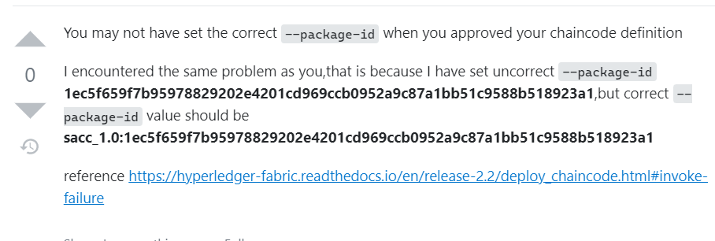

- [中国社区文档](https://hyperledgercn.github.io/hyperledgerDocs/ca-setup_zh/)
# 链码的打包
- 之前已经完成了链码mod的初始化和编译，直接进行打包
```sh
peer lifecycle chaincode package fedfab.tar.gz \
    --path ../../fabric-cluster/chaincode/go/fedfab \
    --label fedfab_5 \
    --lang golang
```
> 在当前目录生成了fedfab.tar.gz文件

# 将打包好的文件复制到其他cli中
```sh
docker cp cli0:/opt/gopath/src/github.com/hyperledger/fabric/peer/fedfab.tar.gz ./
docker cp ./fedfab.tar.gz cli1:/opt/gopath/src/github.com/hyperledger/fabric/peer/
docker cp ./fedfab.tar.gz cli2:/opt/gopath/src/github.com/hyperledger/fabric/peer/
docker cp ./fedfab.tar.gz cli3:/opt/gopath/src/github.com/hyperledger/fabric/peer/
```
# 链码安装
- 在每个cli上对链码进行安装
```sh
peer lifecycle chaincode install fedfab.tar.gz
```
```sh
2022-09-24 11:48:24.568 UTC 0001 INFO [cli.lifecycle.chaincode] submitInstallProposal -> Installed remotely: response:<status:200 payload:"\nIfedfab_5:1389d83d7abb55f640d564f33cf685e13e96fb08698694624ab128e307572fdd\022\010fedfab_3" > 
2022-09-24 11:48:24.568 UTC 0002 INFO [cli.lifecycle.chaincode] submitInstallProposal -> Chaincode code package identifier: fedfab_5:1389d83d7abb55f640d564f33cf685e13e96fb08698694624ab128e307572fdd
```

# 组织org批准链码
```sh
peer lifecycle chaincode approveformyorg --channelID channel2 --name fedfab --version 1.0 --package-id fedfab_5:1389d83d7abb55f640d564f33cf685e13e96fb08698694624ab128e307572fdd  --sequence 5 --init-required --tls true --cafile /opt/gopath/src/github.com/hyperledger/fabric/peer/crypto/ordererOrganizations/fedfab.com/orderers/orderer.fedfab.com/msp/tlscacerts/tlsca.fedfab.com-cert.pem 
```

- org1输出
```sh
2022-09-03 11:12:26.988 UTC 0001 INFO [cli.lifecycle.chaincode] setOrdererClient -> Retrieved channel (channel2) orderer endpoint: orderer.fedfab.com:7051
2022-09-03 11:12:29.067 UTC 0002 INFO [chaincodeCmd] ClientWait -> txid [fcf3b9e351cae89503b256ce5dde76080432eac3b065ad8108be9ce8fbe2443a] committed with status (VALID) at peer0.org1.fedfab.com:8051
```
- org2输出
```sh
2022-09-03 11:12:29.057 UTC 0001 INFO [cli.lifecycle.chaincode] setOrdererClient -> Retrieved channel (channel2) orderer endpoint: orderer.fedfab.com:7051
2022-09-03 11:12:31.110 UTC 0002 INFO [chaincodeCmd] ClientWait -> txid [24e460abf242c2fd86b0a56e6ee045c76c08cd9b77d2bccb66bcd4e315806deb] committed with status (VALID) at peer0.org2.fedfab.com:9051
```
> 每个org提交一次即可

# 验证是否批准成功
```sh
peer lifecycle chaincode queryapproved --channelID channel2 --name fedfab --sequence 3 --tls true --cafile /opt/gopath/src/github.com/hyperledger/fabric/peer/crypto/ordererOrganizations/fedfab.com/orderers/orderer.fedfab.com/msp/tlscacerts/tlsca.fedfab.com-cert.pem --output json
```
```json
{
        "sequence": 1,
        "version": "1.0",
        "endorsement_plugin": "escc",
        "validation_plugin": "vscc",
        "validation_parameter": "EiAvQ2hhbm5lbC9BcHBsaWNhdGlvbi9FbmRvcnNlbWVudA==",
        "collections": {},
        "init_required": true,
        "source": {
                "Type": {
                        "LocalPackage": {
                                "package_id": "09dc77ee99925c9ffd623cdcf6009c125c25bfec709a0986a62a883ef28d1ae4"
                        }
                }
        }
}
```
```sh
peer lifecycle chaincode checkcommitreadiness --channelID channel2 --name fedfab --version 1.0 --init-required --sequence 3 --tls true --cafile /opt/gopath/src/github.com/hyperledger/fabric/peer/crypto/ordererOrganizations/fedfab.com/orderers/orderer.fedfab.com/msp/tlscacerts/tlsca.fedfab.com-cert.pem --output json
```
```json
{
        "approvals": {
                "Org1MSP": true,
                "Org2MSP": true
        }
}
```

# 提交
```sh
peer lifecycle chaincode commit -o orderer.fedfab.com:7050 --channelID channel2 --name fedfab --version 1.0 --sequence 5 --tls true  --init-required --cafile /opt/gopath/src/github.com/hyperledger/fabric/peer/crypto/ordererOrganizations/fedfab.com/orderers/orderer.fedfab.com/msp/tlscacerts/tlsca.fedfab.com-cert.pem \
    --peerAddresses peer0.org1.fedfab.com:8051 --tlsRootCertFiles /opt/gopath/src/github.com/hyperledger/fabric/peer/crypto/peerOrganizations/org1.fedfab.com/peers/peer0.org1.fedfab.com/tls/ca.crt \
    --peerAddresses peer1.org1.fedfab.com:8053 --tlsRootCertFiles /opt/gopath/src/github.com/hyperledger/fabric/peer/crypto/peerOrganizations/org1.fedfab.com/peers/peer1.org1.fedfab.com/tls/ca.crt \
    --peerAddresses peer2.org1.fedfab.com:8055 --tlsRootCertFiles /opt/gopath/src/github.com/hyperledger/fabric/peer/crypto/peerOrganizations/org1.fedfab.com/peers/peer2.org1.fedfab.com/tls/ca.crt \
    --peerAddresses peer0.org2.fedfab.com:9051 --tlsRootCertFiles /opt/gopath/src/github.com/hyperledger/fabric/peer/crypto/peerOrganizations/org2.fedfab.com/peers/peer0.org2.fedfab.com/tls/ca.crt

```
```sh
2022-09-03 22:04:17.335 UTC 0001 INFO [chaincodeCmd] ClientWait -> txid [2468ffb8850ef91b0e3643cdc347fead1e9c39e8c0de8e5528b687b06d4e8ddb] committed with status (VALID) at peer1.org1.fedfab.com:8053
2022-09-03 22:04:17.338 UTC 0002 INFO [chaincodeCmd] ClientWait -> txid [2468ffb8850ef91b0e3643cdc347fead1e9c39e8c0de8e5528b687b06d4e8ddb] committed with status (VALID) at peer2.org1.fedfab.com:8055
2022-09-03 22:04:17.338 UTC 0003 INFO [chaincodeCmd] ClientWait -> txid [2468ffb8850ef91b0e3643cdc347fead1e9c39e8c0de8e5528b687b06d4e8ddb] committed with status (VALID) at peer0.org1.fedfab.com:8051
2022-09-03 22:04:17.338 UTC 0004 INFO [chaincodeCmd] ClientWait -> txid [2468ffb8850ef91b0e3643cdc347fead1e9c39e8c0de8e5528b687b06d4e8ddb] committed with status (VALID) at peer0.org2.fedfab.com:9051
```
# 链码的调用

## 输入一个键值对`a:bb`
```sh
peer chaincode invoke -o orderer.fedfab.com:7050 --isInit --ordererTLSHostnameOverride orderer.fedfab.com --cafile /opt/gopath/src/github.com/hyperledger/fabric/peer/crypto/ordererOrganizations/fedfab.com/orderers/orderer.fedfab.com/msp/tlscacerts/tlsca.fedfab.com-cert.pem --channelID channel2 --name fedfab --tls true \
    --peerAddresses peer0.org1.fedfab.com:8051 --tlsRootCertFiles /opt/gopath/src/github.com/hyperledger/fabric/peer/crypto/peerOrganizations/org1.fedfab.com/peers/peer0.org1.fedfab.com/tls/ca.crt \
    --peerAddresses peer1.org1.fedfab.com:8053 --tlsRootCertFiles /opt/gopath/src/github.com/hyperledger/fabric/peer/crypto/peerOrganizations/org1.fedfab.com/peers/peer1.org1.fedfab.com/tls/ca.crt \
    --peerAddresses peer2.org1.fedfab.com:8055 --tlsRootCertFiles /opt/gopath/src/github.com/hyperledger/fabric/peer/crypto/peerOrganizations/org1.fedfab.com/peers/peer2.org1.fedfab.com/tls/ca.crt \
    --peerAddresses peer0.org2.fedfab.com:9051 --tlsRootCertFiles /opt/gopath/src/github.com/hyperledger/fabric/peer/crypto/peerOrganizations/org2.fedfab.com/peers/peer0.org2.fedfab.com/tls/ca.crt \
    -c '{"Args":["a", "bb"]}'

```

```sh
2022-09-03 22:32:26.926 UTC 0001 INFO [chaincodeCmd] chaincodeInvokeOrQuery -> Chaincode invoke successful. result: status:200 
```

> 这个地方出错失败了很多次，原因是之前approve chaincode时，指定的package-id不正确，在approve的前一步install的输出中，输出的package-id是：
> >Chaincode code package identifier: fedfab_2:cf7c1115e177f200ee6383d455b563e1df20721e0dccb6bb9cbf43e95d008739
>
> chaincode的package-id是`lable:一串数字`，在approve时指定pkgid时必须完整，不能只指定后面的一串数字，重新在org中进行approve操作，则可以正确执行链码


> 这个回答的reference是官网的文档[deploy_chaincode](https://hyperledger-fabric.readthedocs.io/en/release-2.2/deploy_chaincode.html#invoke-failure)中的内容

## 查询`a`的值
```sh
peer chaincode query -C channel2 -n fedfab -c '{"Args":["query", "a"]}'
```
```sh
bb
```

## 修改`a`的值为`cc`，并查询验证
```sh
peer chaincode invoke -o orderer.fedfab.com:7050 --cafile /opt/gopath/src/github.com/hyperledger/fabric/peer/crypto/ordererOrganizations/fedfab.com/orderers/orderer.fedfab.com/msp/tlscacerts/tlsca.fedfab.com-cert.pem --channelID channel2 --name fedfab --tls true \
    --peerAddresses peer0.org1.fedfab.com:8051 --tlsRootCertFiles /opt/gopath/src/github.com/hyperledger/fabric/peer/crypto/peerOrganizations/org1.fedfab.com/peers/peer0.org1.fedfab.com/tls/ca.crt \
    --peerAddresses peer1.org1.fedfab.com:8053 --tlsRootCertFiles /opt/gopath/src/github.com/hyperledger/fabric/peer/crypto/peerOrganizations/org1.fedfab.com/peers/peer1.org1.fedfab.com/tls/ca.crt \
    --peerAddresses peer2.org1.fedfab.com:8055 --tlsRootCertFiles /opt/gopath/src/github.com/hyperledger/fabric/peer/crypto/peerOrganizations/org1.fedfab.com/peers/peer2.org1.fedfab.com/tls/ca.crt \
    --peerAddresses peer0.org2.fedfab.com:9051 --tlsRootCertFiles /opt/gopath/src/github.com/hyperledger/fabric/peer/crypto/peerOrganizations/org2.fedfab.com/peers/peer0.org2.fedfab.com/tls/ca.crt \
    -c '{"Args":["set", "a", "cc"]}'
peer chaincode query -C channel2 -n fedfab -c '{"Args":["query", "a"]}'
```

```sh
2022-09-04 07:48:30.012 UTC 0001 INFO [chaincodeCmd] chaincodeInvokeOrQuery -> Chaincode invoke successful. result: status:200 payload:"cc" 
cc
```

> 之前失败了几次，试图重新搭建网络，但是即使所有容器都删除后，网络似乎还有一定的“记忆”。并且不能使用新生成的证书文件（否则会报错），只能使用第一次生成的证书文件。(已解决)

# docker network
> 在编写docker compose文件时，会配置一个network，起初认为这是定义fabric网络特有的，后来发现是docker的功能。
- [参考资料](http://www.hangdaowangluo.com/archives/2197)

- 容器网络模型（Container Network Model，简称CNM），只要符合这个模型的网络接口就能被用于容器之间通信，而通信的过程和细节可以完全由网络接口来实现。
- [参考](https://m.tongfu.net/home/35/blog/513355.html)中详细讲解了docker compose 中使用networks定义网络

# fedml与fabric交互
- 编写application，为了让fabric与fedml结合，需要有调用fabric的api，在fabric训练的不同阶段调用fabric的api达到交互的目的。但是fedml是python代码，api提供了js和java，调用起来相对麻烦一些
- 使用与hyperledger fabric同名的一个python库fabric，远程连接cli的docker执行命令，感觉这样安全性较差
- 直接使用[python sdk](https://github.com/hyperledger/fabric-sdk-py)
- [fabric的jira](https://wiki.hyperledger.org/display/fabric/Hyperledger+Fabric)

## python sdk
- [sdk文档](https://fabric-sdk-py.readthedocs.io/en/latest/tutorial.html)
- [sdk的pypi链接](https://pypi.org/project/fabric-sdk-py/)
- 通过pypi查询，它最后一次更新在2020年8月，主要支持fabric 1.4.x版本

## 使用node
- 使用node编写js代码，如实现invoke等功能，再为每个功能指定一个端口，使用node为每个功能建立http服务。在fedml训练过程中，按照需要调用这些接口，即可以实现上述功能
- [node实现get、post请求的教程](https://www.runoob.com/nodejs/node-js-get-post.html)

# node sdk 简介
- [参考](https://hyperledger.github.io/fabric-sdk-node/release-2.2/module-fabric-network.html)

> 此 API 目前不提供管理功能，例如安装和启动智能合约。对于特定的高级用法，可以使用较低级别的fabric-common API。


> 用于与 Hyperledger Fabric 区块链网络交互的入口点是 Gateway类。一旦实例化，这个长期存在的对象提供了与区块链网络中的对等点的可重用连接，并允许访问该对等点所属的任何区块链 网络（通道）。提供了对该区块链网络中运行的智能合约（链码）的访问，并且可以向其 提交交易或 评估查询。
# fabric-gateway简介
[参考](https://hyperledger-fabric.readthedocs.io/en/latest/gateway.html)
- fabric gateway是fabric v2.4 引入的一项服务，它提供用于将事务提交到fabric网络的最简化的API
- 
## 示例代码
```ts
import * as grpc from '@grpc/grpc-js';
import * as crypto from 'crypto';
import { connect, Identity, signers } from '@hyperledger/fabric-gateway';
import { promises as fs } from 'fs';
import { TextDecoder } from 'util';

const utf8Decoder = new TextDecoder();

async function main(): Promise<void> {
    const credentials = await fs.readFile('path/to/certificate.pem');
    const identity: Identity = { mspId: 'myorg', credentials };

    const privateKeyPem = await fs.readFile('path/to/privateKey.pem');
    const privateKey = crypto.createPrivateKey(privateKeyPem);
    const signer = signers.newPrivateKeySigner(privateKey);

    const client = new grpc.Client('gateway.example.org:1337', grpc.credentials.createInsecure());

    const gateway = connect({ identity, signer, client });
    try {
        const network = gateway.getNetwork('channelName');
        const contract = network.getContract('chaincodeName');

        const putResult = await contract.submitTransaction('put', 'time', new Date().toISOString());
        console.log('Put result:', utf8Decoder.decode(putResult));

        const getResult = await contract.evaluateTransaction('get', 'time');
        console.log('Get result:', utf8Decoder.decode(getResult));
    } finally {
        gateway.close();
        client.close()
    }
}

main().catch(console.error);
```

# 运行ts文件
- [参考](https://github.com/hyperledger/fabric-gateway/blob/main/node/README.md)
- [参考代码](https://github.com/hyperledger/fabric-samples/blob/main/asset-transfer-basic/application-gateway-typescript/src/app.ts)
- 安装依赖
```sh
npm install @hyperledger/fabric-gateway
npm install @grpc/grpc-js
```
- 安装ts

```sh
tar -zxvf node-v16.17.0-linux-x64.tar.xz
sudo mv node-v16.17.0-linux-x64 /usr/local/node
vim tee -a /etc/profile <<-'EOF'
export NODE_HONE=/usr/local/node
export PATH=$PATH:$NODE_HONE/bin
EOF
source /etc/profile
npm install -g typescript
npm install ts-node -D
tsc -v
```

- 运行ts文件

```sh
npx ts-node src/app.ts
```
- 对a的get，set，get，再对b（原来没有的key） set，get
```sh
/home/tt/Desktop/fabric/my-network/nodes/crypto-config/peerOrganizations/org1.fedfab.com
channelName:       channel2
chaincodeName:     fedfab
mspId:             Org1MSP
cryptoPath:        /home/tt/Desktop/fabric/my-network/nodes/crypto-config/peerOrganizations/org1.fedfab.com
keyDirectoryPath:  /home/tt/Desktop/fabric/my-network/nodes/crypto-config/peerOrganizations/org1.fedfab.com/users/User1@org1.fedfab.com/msp/keystore
certPath:          /home/tt/Desktop/fabric/my-network/nodes/crypto-config/peerOrganizations/org1.fedfab.com/users/User1@org1.fedfab.com/msp/signcerts/User1@org1.fedfab.com-cert.pem
tlsCertPath:       /home/tt/Desktop/fabric/my-network/nodes/crypto-config/peerOrganizations/org1.fedfab.com/peers/peer0.org1.fedfab.com/tls/ca.crt
peerEndpoint:      localhost:8051
peerHostAlias:     peer0.org1.fedfab.com

--> Evaluate Transaction: Invoke, function returns all the current assets on the ledger
*** Result: bb

--> Evaluate Transaction: Invoke, function returns all the current assets on the ledger
*** Result: dd

--> Evaluate Transaction: Invoke, function returns all the current assets on the ledger
*** Result: dd

--> Evaluate Transaction: Invoke, function returns all the current assets on the ledger
*** Result: cc

--> Evaluate Transaction: Invoke, function returns all the current assets on the ledger
*** Result: cc
```

# 创建http服务
使用node-http等库，建立http服务，就可以通过网络请求的方式访问区块链
```json
http://10.128.196.184:3000/invokeChaincode
body:json
{
    "peer": 0,
    "org": 2,
    "function": "set",
    "key": "a",
    "val": "bb"
}
```

```json
http://10.128.196.184:3000/invokeChaincode
body:json
{
    "peer": 0,
    "org": 2,
    "function": "get",
    "key": "a"
}
```

- [代码](./my-network-api/api/src/server.ts)